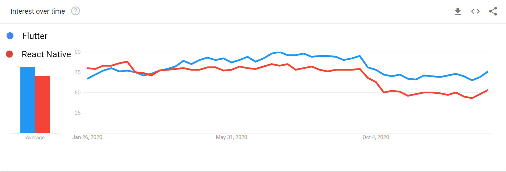
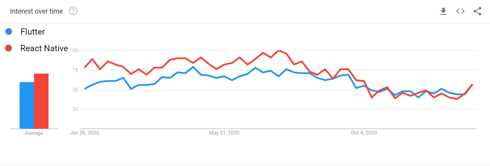
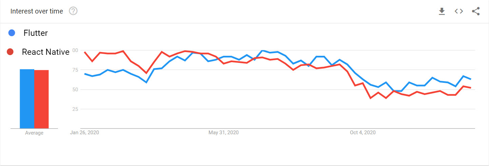

Lets try to make it short!

React Native is available since March 2015 where as Flutter is released on May 2017. Both are doing a great job for creating cross platform applications and if you are starting to develop new application, consider the following which may help choosing the right one!

<dl>
  <dt>Flutter</dt>
  <dd>Open-source UI software development kit created by Google.</dd>

  <dt>React Native</dt>
  <dd>Open-source mobile application framework created by Facebook, Inc.</dd>
</dl>

|   Flutter  |   React   |
|   ---      |   ---     |
| Dart programming language introduced by Google | Javascript |
| Has everything needed for app development in the Flutter engine itself. Skia C++ engine | JavaScript bridge to communicate with the native modules. Flux architecture |
| Rich in Components |  Less Components - too much dependent on third-party libraries |
| Has hot reload | Has hot reload |
| Fairly new at this point but will catch up very soon as the community around Flutter is growing | Great developer support in terms of IDEs and language features |
| Great documentation and a rich set of testing features | No official support for integration and UI level testing. Use third party tools like Appium, Detox |
| Has a great build automation tooling and can be used to deploy apps from the command line | Lack support for the CLI tools that are officially supported for build automation |
| Easy and painless to set up on CI/CD services by using its strong CLI tools | Doesn’t provide any official instructions for CI/CD practices |
| Apps : Xianyu app by Alibaba, Hamilton app for Hamilton Musical, Google Ads app | Apps: Instagram, Facebook, Facebook Ads, Skype, Tesla |

 
Take a look at the google trends world wide for the last year

in USA

in India

[Stack overflow](http://sotagtrends.com/?tags=react-native+flutter&relative=false) tag trends show an intense increase in developer interest in Flutter

In conclusion: Even though React Native has gained more popularity because it was released early, Flutter is growing rapidly among the community.

