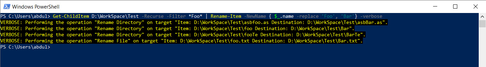

**Rename part of folder and file names under a directory:**

`Get-ChildItem D:\folderpath\ -Recurse -Filter *foo* | Rename-Item -NewName { $_.name -replace 'foo', 'bar'} -verbose`

This command performs recursively and rename all the files and folders according the filter. In the above command we are replacing 'foo' by 'bar' and as an output, any files/folders having 'foo' will get replaced by 'bar'.
The folder path can be specified by using either forward slash or backslash

Here is a screenshot:

 
 

**Delete subfolders recursively:**

`get-childitem D:\folderpath\ -Include obj -Recurse -force | Remove-Item -Force -Recurse`

The above command delete all 'obj' folders under the specified directory recursively.